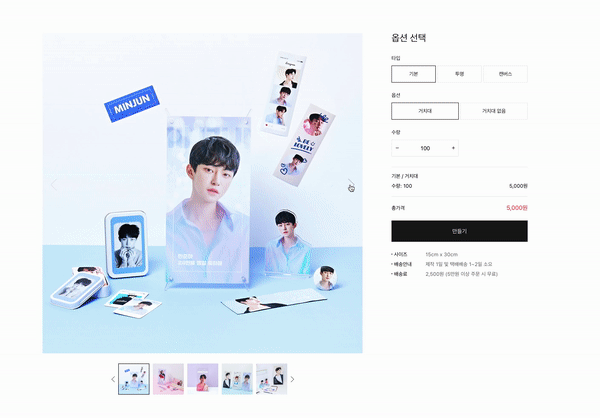
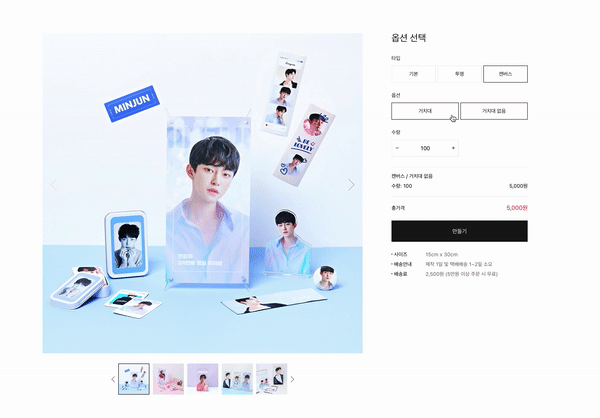

# Snaps Frontend Assignment

## Preview

 

 

## Features

- 좌/우로 이미지를 스와이프 하는 기능

- 선택된 썸네일 이미지와 메인 이미지의 연동

- 옴션 선택에 따른 상태 변화

- 기본 버튼을 누를 시 다시 첫 기본 이미지로 이동

- 만들기 버튼 클릭 시 현재 옵션을 콘솔에 기록함

- 만들기 버튼 클릭 시 수량 오류를 점검함.

## Project Log

- 스와이프 기능 중 transition 시에 모든 브라우저에서 적용 될 수 있도록 webkit뿐만 아니라 -moz, -ms, -o 벤더 프리픽스를 사용했습니다.

- 애니메이션 구현 등에 있어서 브라우저의 리페인트를 피하고자 transform 등을 이용하여 구현하였습니다.

- 아이콘 버튼 구현 시 png 대신 svg파일을 이용하여 화면비율에 따른 이미지의 화질 저하 현상을 방지하려고 했습니다.

- component unit 테스트케이스를 작성하였습니다.

## Comment

- 과제안내 사항에 있는 스와이프 기능 구현 시 잘못인지를 하여 마우스 드래그로 스와이프하는 기능을 과제 후반에 진행하여 미숙하게 완성하여 아쉬웠습니다. onDrag이벤트 발생 중간에 부분을 완성하지 못하고 드래그 시작과 끝나는 시점에만 대응하여 드래그 이벤트를 구현하였습니다.

- 이번 과제를 통해 스와이프 구현 시 transition 동작 에서만 크로스 브라우징을 고려하였습니다. 브라우저에는 크롬만 있는 것이 아니고 다른 브라우저를 이용하는 유저들이 있기 때문에 앞으로도 크로스 브라우징에 대해서 고민해야겠다고 생각했습니다.
